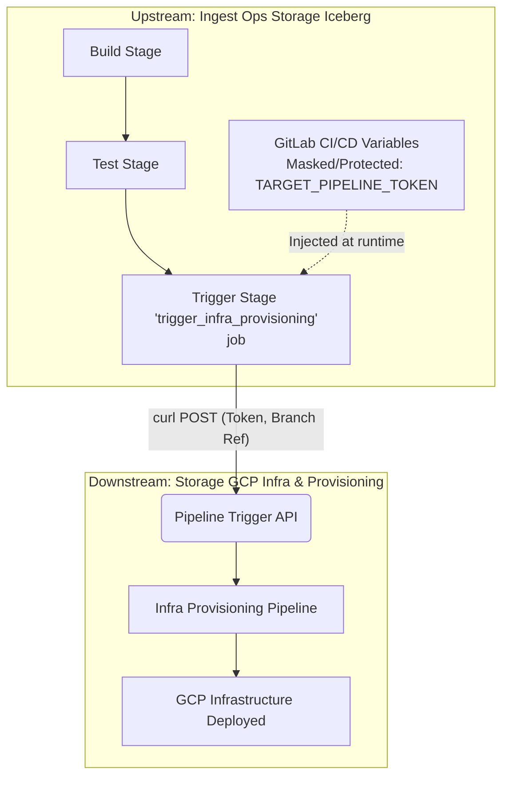
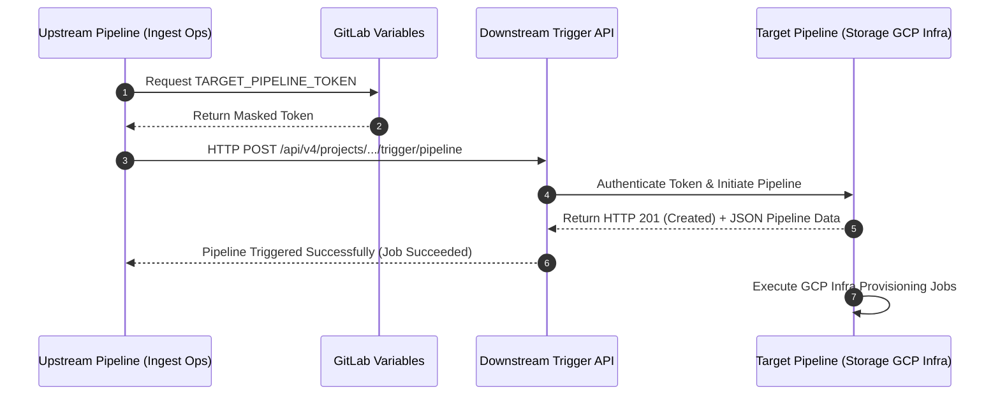

Here is the updated Confluence documentation. I have added a new **Architecture Diagrams** section using Mermaid.js syntax. You can paste these directly into Confluence using the native **Mermaid macro** (type `/mermaid` in the Confluence editor) to automatically render them into professional architectural visuals.

---

# 📄 Cross-Project Pipeline Trigger Architecture

**Document Owner:** Sharvari Namra

**Status:** Proposed / Approved

**Date:** August 2026

---

## 1. Overview

This document outlines the architectural decision and implementation strategy for executing a cross-project CI/CD pipeline. Specifically, it details the mechanism used to trigger the downstream **Storage GCP Infra and Infra Provisioning** pipeline directly from the upstream **Ingest Ops Storage Iceberg Pipeline** project within GitLab.

## 2. Options Explored

During the discovery phase, two primary methods for triggering cross-project pipelines in GitLab were evaluated:

### Option A: GitLab Native `trigger` Keyword

* **Mechanism:** Utilizing the built-in `trigger: project: ...` syntax within the `.gitlab-ci.yml` file.
* **Pros:** Clean syntax; built directly into GitLab CI; natively visualizes the downstream pipeline in the UI.
* **Cons:** Relying on the default `CI_JOB_TOKEN` requires configuring cross-project pipeline access permissions in the downstream project. It lacks the flexibility needed for customized API payloads, dynamic variable injection, or strict access control boundaries.

### Option B: GitLab Pipeline Trigger API (via `curl`)

* **Mechanism:** Creating a dedicated Pipeline Trigger Token in the downstream project and executing a REST API `curl` call from the upstream pipeline script.
* **Pros:** Highly secure; allows for fine-grained control over the HTTP request; isolates permissions so the upstream project only has the right to trigger the pipeline and nothing else.
* **Cons:** Requires manual URL encoding of the project path and manual handling of the API response.

---

## 3. Recommended Solution: Pipeline Trigger API

**Recommendation:** **Option B (Pipeline Trigger API)** is the recommended approach for this architecture.

By utilizing a REST API call authenticated via a dedicated Pipeline Trigger Token, we establish a secure, decoupled mechanism to initiate the infrastructure provisioning stage without exposing broader project permissions.

### Detailed Implementation Steps

**Step 1: Generate a Pipeline Trigger Token in the Target Project**

1. Navigate to the downstream project: **Storage GCP Infra and Infra Provisioning**.
2. Go to **Settings** > **CI/CD** on the left sidebar.
3. Expand the **Pipeline triggers** section.
4. Provide a descriptive name (e.g., `ingest-ops-trigger-token`) and click **Add trigger**.
5. Copy the generated token value. *(Note: This token will only be shown once).*

**Step 2: Securely Store the Token in the Source Project**

1. Navigate to the upstream project: **Ingest Ops Storage Iceberg Pipeline**.
2. Go to **Settings** > **CI/CD** > **Variables** and expand the section.
3. Click **Add variable**.
4. Set the **Key** to `TARGET_PIPELINE_TOKEN`.
5. Paste the copied token into the **Value** field.
6. **Crucial Security Step:** Check both the **Masked** and **Protected** boxes to ensure the token is scrubbed from job logs and only accessible on protected branches.
7. Click **Add variable**.

**Step 3: Format the API Endpoint**
The GitLab API requires the target project path to be strictly URL-encoded. Replace all forward slashes (`/`) in the target project's path with `%2F`.

* *Example:* If the URL to the target project is `[gitlab.com/storage-gcp-infra/infra-provisioning](https://gitlab.com/storage-gcp-infra/infra-provisioning)`, the encoded path becomes `storage-gcp-infra%2Finfra-provisioning`.

**Step 4: Configure the Upstream Pipeline (`.gitlab-ci.yml`)**
Add a dedicated job to the upstream project to execute the trigger. Align this job with a specific stage (e.g., `trigger`).

```yaml
stages:
  - build
  - test
  - trigger

trigger_infra_provisioning:
  stage: trigger
  image: curlimages/curl:latest
  script:
    - >
      curl -X POST \
        --fail \
        -F token=$TARGET_PIPELINE_TOKEN \
        -F ref=main \
        "https://gitlab.example.com/api/v4/projects/storage-gcp-infra%2Finfra-provisioning/trigger/pipeline"
  rules:
    - if: '$CI_COMMIT_BRANCH == "main"'

```

*(Note: Replace `gitlab.example.com` and the exact encoded project path with your specific GitLab instance details).*

---

## 4. Architecture Diagrams

*(Instructions: Paste the code blocks below into a Confluence **Mermaid macro** to render the diagrams).*

### 4.1. Structural Flowchart

This diagram illustrates the separation of concerns and the secure parameter passing between the two isolated projects.



### 4.2. Execution Sequence Diagram

This diagram details the programmatic step-by-step execution and response handling during the cross-project trigger event.



---

## 5. Advantages of the Implemented Solution

This architectural approach offers several significant advantages for our infrastructure:

1. **Principle of Least Privilege (Security):** The upstream project *only* has permission to trigger the downstream pipeline. It cannot read code, modify settings, or access unrelated downstream variables, establishing a strict security boundary.
2. **Secure Credential Management:** The trigger token is stored as a masked and protected variable. It is completely hidden from all CI/CD job logs, preventing credential leaks.
3. **Complete Environmental Isolation:** The Ingest Ops and Storage GCP Infra projects remain loosely coupled. The upstream project does not need to inherit or share complex runner environments or service accounts with the infrastructure provisioning pipeline.
4. **Extensibility:** Because this utilizes a standard REST POST request, we can easily extend the `curl` command to pass dynamic `variables[KEY]=value` parameters (such as specific GCP environment tags, commit SHAs, or data payload references) directly into the downstream deployment environment.
